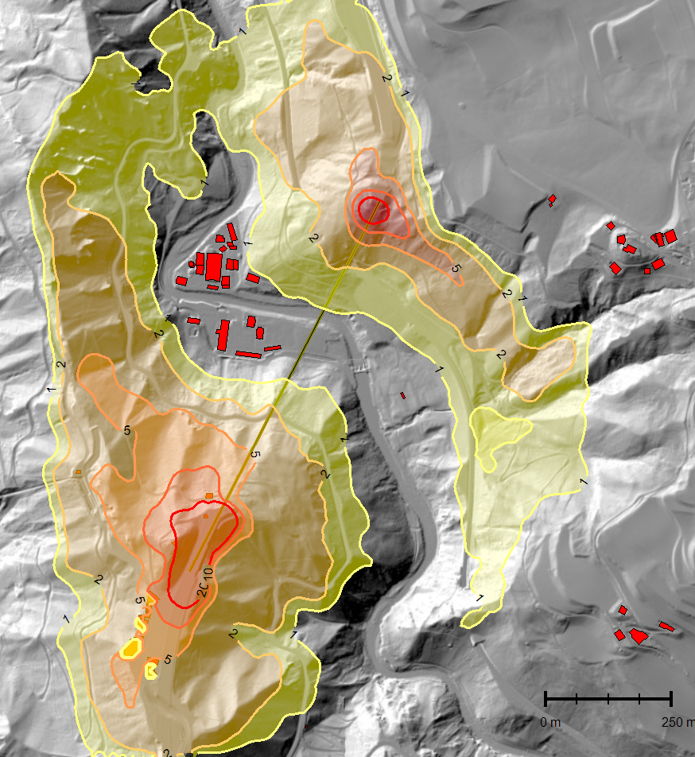
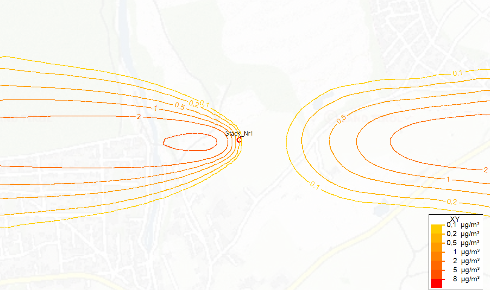

# GRAL samples 
These examples are intended to familiarize with the first application of the model and to illustrate the possibilities of the model system.  
In the figure below you see the result of the example AscendingBridge. In this example, a valley is traversed by the bridge at a height of more than 100 m. 
The source configurations are arbitrary and do not represent the reality. Also, the wind fields are truncated so that the examples can be calculated very fast. The wind data represents one day, so you can see a 24 hour mean value of the concentration in a height of 3 m above terrain here. 
With the topography map displayed in the background, the influence of the topography on the dispersion is clearly visible.  

  

The example PointSourceProject is calculated on flat terrain without buildings and shows a typical concentration dispersion of a stack. The different stability classes and wind speeds lead to different concentration patterns towards the west and the east of the source.  

  

